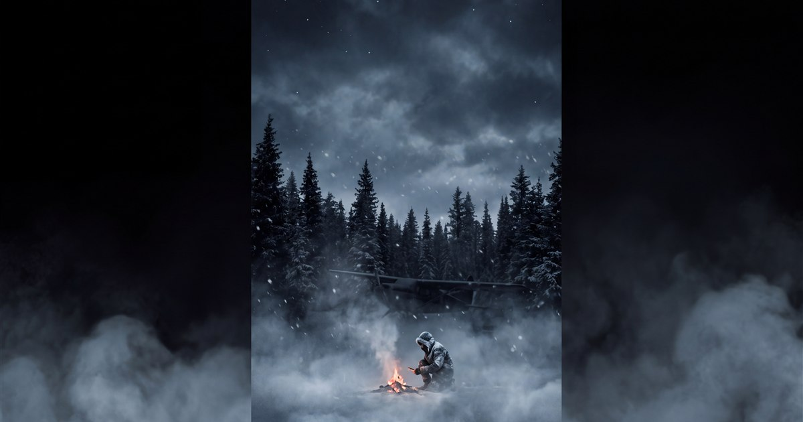
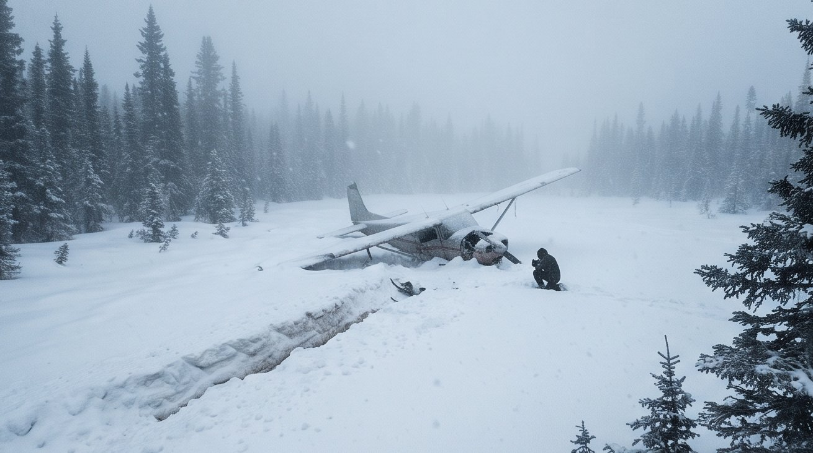
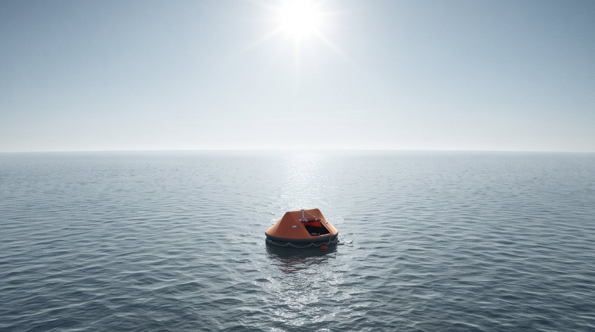
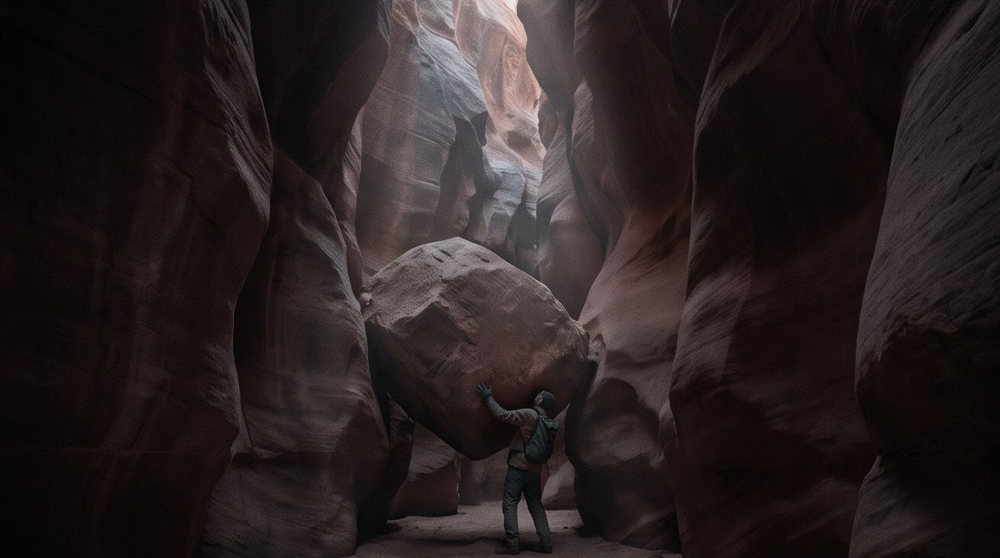
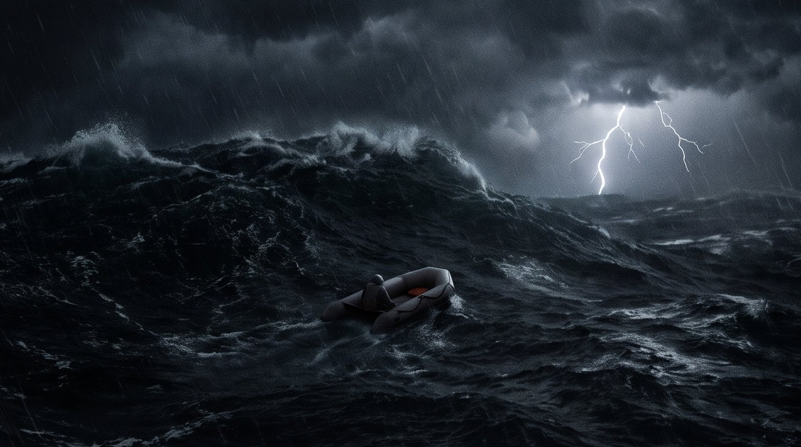
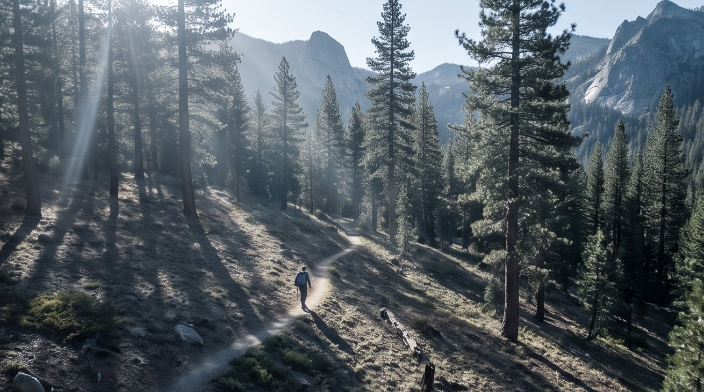
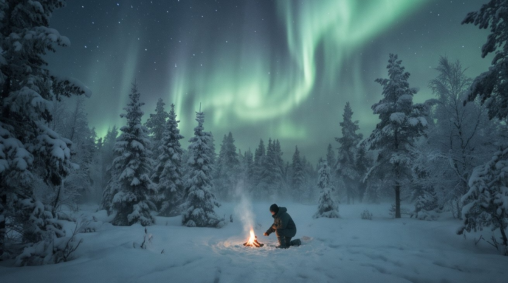

# STILL BREATHING — *a survival*

**▶ Play it: https://kylefriesmarketing.github.io/still-breathing/** · part of [THE SHELF](https://kylefriesmarketing.github.io/games/)

A branching survival thriller about the four clocks that kill people — and the one thing that
brings them back. Every ordeal is reconstructed from a **documented true survival case**, and
every deadly choice is a **real survival myth** that has actually gotten someone killed.

> Three minutes without air. Three hours without shelter. Three days without water.
> Three weeks without food. And underneath all of them: the mind, deciding.

## The four ordeals

| Ordeal | Where it goes wrong | Grounded in |
|---|---|---|
| **The White Mile** | Your bush plane is down in the subarctic; the pilot isn't getting up; the cold never stops subtracting | Juliane Koepcke — fell 2 miles into the Amazon, walked out downstream in 11 days |
| **The Raft** | A whale holed your sloop at 3 a.m.; now it's six feet of rubber and the whole Atlantic | Steven Callahan — 76 days adrift; solar stills, speared dorado, saved by the birds over his raft |
| **The Pinch** | A boulder shifted and took your arm to the canyon wall; nobody knows where you went | Aron Ralston — 127 hours in Blue John Canyon, and the only door out |
| **The Trailhead** | A marked trail, a thirty-second detour — and the forest deletes the path home | Amanda Eller — 17 days lost on Maui; found from the air because she could be found |

## How it plays

- **Five vitals on the Rule of Threes** — Grip (will to live — the master), Core, Water, Food,
  Body. Each hits zero by its real mechanism: hypothermia, heatstroke, salt arithmetic, the drain.
- **The Grip mirage** — as your will fails, the narration itself becomes unreliable: words waver,
  and the deadly choices start wearing seductive little labels. Impaired cognition, dramatized.
- **Myth vs. truth** — the intuitive option is usually the killer: eat snow, drink seawater, take
  the jacket off, leave the wreck, swim for it, tear the arm free, follow the drainage down.
- **Being findable is a job** — signal mirrors, flares, tarp Xs, whistle threes; the Rescue meter
  is the win-track, and it only moves when you work it.
- **The Log & They Came Back** — journal pages inscribe only if you live; survive an ordeal and
  meet the real person behind it.
- **The ordeals remember each other** — survive the White Mile and its river rule comes back to
  tempt you in the Trailhead, where downstream is a lie. Terrain decides which rules are true.
- **The Pocket Kit** — pick 3 of 6 small items before each run (*Alone*-style). A lighter, ten
  feet of paracord, a headlamp, iodine tabs, two energy bars, a wool layer — each unlocks real
  techniques in some ordeals and is dead weight in others. Iodine doesn't work on the sea.
- **The Long Winter** — survive an ordeal once and its hard mode opens: two items, a colder
  start, and the mirage never lifts — the game lies to you at full strength from the first
  choice. Every myth you believe costs extra will. ❄
- Survive all four and the game tells you what the survivors know.

## Screenshots

| | | |
|---|---|---|
|  |  |  |
|  |  |  |

## Tech

Vanilla JS, zero dependencies, fully static. Generative WebAudio score (no audio files) with a
"held-on" motif that only rings while your Grip holds. Scene art is AI-generated cinematic stills
(frostbitten-realism, batch-sheet pipeline) with a full **procedural SVG fallback** — delete the
assets folder and the game still plays. `~` opens the field-lantern debug panel; `m` mutes.

Run locally: serve the folder with any static server (e.g. `powershell -File serve.ps1`, then
open `http://localhost:8321/index.html`).

## Grounding

*Deep Survival* (Laurence Gonzales) · *Adrift: Seventy-six Days Lost at Sea* (Steven Callahan) ·
*Between a Rock and a Hard Place* (Aron Ralston) · LANSA Flight 508 (Juliane Koepcke) · the
Amanda Eller search · History's *Alone* · standard survival-myth literature. Built with respect
for the people who lived these, and the ones who didn't.
